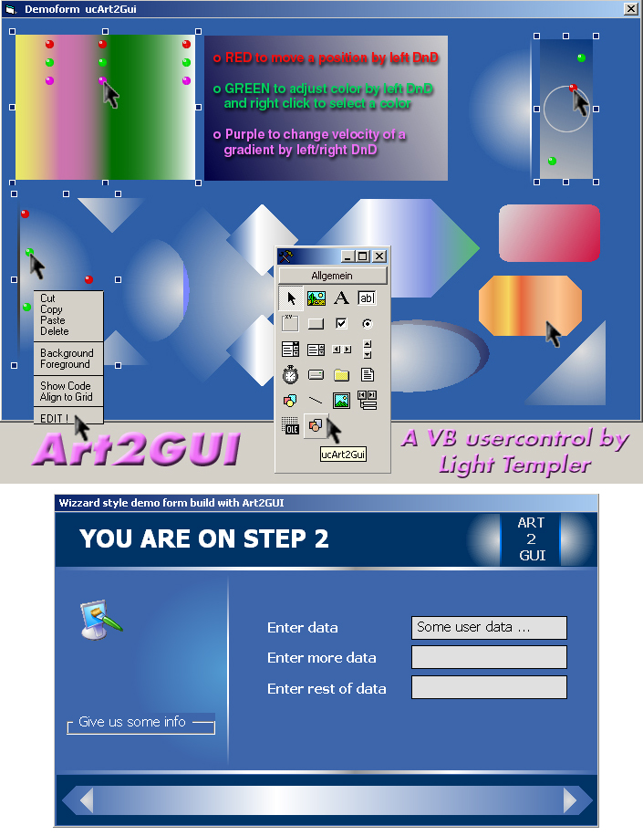



## ART2GUI \- A tribute to the VISUAL in VB6 by Light Templer

### Description

This usercontrol is a very interactive replacement for old VB shape control. Interactive just in IDE, the end user of an app gets the nice design only.

But the programmer maybe gets the most interactive VB usercontrol ever ;-) !

Adjust gradient parameters, postions, designs directly on the screen, no need to use the property box for every single value. Thx to Carles P.V. we have fantastic gradients and thx to Lavolpe we have MANY fancy forms for modern screen designs. Anti-aliased circles, endless combinations of colors with shapes are inviting to

play arround with. All put together in a selfcontained, ownerdrawn and documented

usercontrol (without any subclassing or timers) by Light Templer. Enjoy ;-) 

----

UPDATE 1: (1) Fixed the error raised when drop a new control error onto form with 'Break on all Errors' switch activated.

(2) Added a VB5 "version" - Its totally the same control just stripped out the usercontrol property VB5 don't have (ClipBehavior). Sorry for just a simple demo form here.

----

UPDATE 2: Rebuild the demo form and added a 2nd (more serious) demo as requested.

----

UPDATE 3: Fixed the problem coming from german VB version (storage format of single var properties in .frm demo file) with a universal small function to get the value in all cases. 

----

UPDATE 4: Finally got this strange error of don't working on some systems! A BIG sorry! Now it should be fine on every VB / SP version.
 
### More Info
 

             |
---                |---
**Submitted On**   |2006-12-05 22:59:54
**By**             |[Light Templer](https://github.com/Planet-Source-Code/PSCIndex/blob/master/ByAuthor/light-templer.md)
**Level**          |Intermediate
**User Rating**    |4.9 (187 globes from 38 users)
**Compatibility**  |VB 5\.0, VB 6\.0
**Category**       |[Custom Controls/ Forms/  Menus](https://github.com/Planet-Source-Code/PSCIndex/blob/master/ByCategory/custom-controls-forms-menus__1-4.md)
**World**          |[Visual Basic](https://github.com/Planet-Source-Code/PSCIndex/blob/master/ByWorld/visual-basic.md)
**Archive File**   |[ART2GUI\_\-\_2035821262006\.zip](https://github.com/Planet-Source-Code/light-templer-art2gui-a-tribute-to-the-visual-in-vb6-by-light-templer__1-65868/archive/master.zip)

